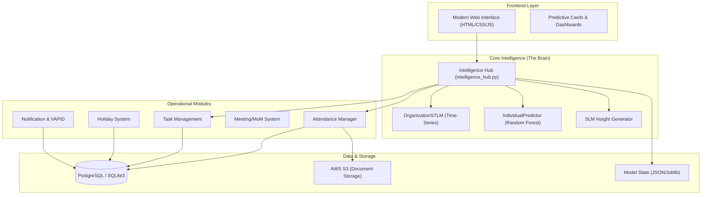

# Project "Intelligence Hub" - AI Context & Architecture

This document serves as the **Single Source of Truth (SSoT)** for AI models to understand the architecture, logic, and data flow of the Attendance and Personnel Management System. It is designed to provide immediate context for any LLM or Agentic AI interacting with this codebase.

---

## 🏗️ System Architecture (The "Nodes")

The system is built on a **Modular Django Micro-monolith** architecture, where the `attendance` app serves as the core intelligence and operational engine.

---

## 📊 Data Schema & Key Entities

### 1. Personnel (Nodes)
- **Employee**: The central entity. Roles: `employee`, `mentor`, `admin`.
- **EmployeeProfile**: Extended metadata (Bank details, Skills, Documents).
- **Team**: Recursive grouping of Employees under Mentors.
- **Memoji**: Custom personalized avatar configurations.

### 2. Events & Records (Edges)
- **AttendanceRecord**: Daily logs (`present`, `wfh`, `client`, `half_day`, `absent`, `leave`).
- **EmployeeRequest**: Lifecycle of WFH and Leave requests (`pending`, `approved`, `rejected`).
- **Holiday**: Mandatory and Optional holiday management with selection constraints (max 2/year).

### 3. Productivity & Collaboration
- **Task**: Multi-assignee tasks with history tracking and accuracy scoring.
- **Meeting**: Integration for Minutes of Meeting (MoM) and participants.

---

## 🧠 AI/ML Engine Logic

The system utilizes a **Hybrid Structural Time-Series LSTM-inspired (STLM)** approach for forecasting.

### 1. OrganizationSTLM (Macro Forecasting)
- **Seasonality**: Decomposes attendance into Day-of-Week (DOW) patterns.
- **Trend/Momentum**: Calculates `recent_avg / long_avg` to detect participation shifts.
- **Residual Model**: Uses a `RandomForestRegressor` to predict deviations from the expected seasonal baseline.
- **Self-Healing**: If the trained model state (`model_state.json`) is >48h old, the engine falls back to live-DB DOW pattern calculation.

### 2. IndividualPredictor (Micro Forecasting)
- **Features**: Attendance consistency, normalized working hours, leave history, and task efficiency.
- **Probability**: Predicts the likelihood of an employee appearing on a specific date based on historical weighted vectors.

### 3. SLM Insight Generator
- Translates raw metrics (forecast %, confidence score, late rate) into human-readable executive summaries using localized logic.

---

## 🔄 System Flow: Attendance Lifecycle

1.  **Input**: Employee marks attendance (Location + Photo).
2.  **Validation**: Geofencing against `OfficeLocation` + Radius.
3.  **Persistence**: `AttendanceRecord` created; `STATUS_WEIGHTS` applied for analytics.
4.  **Intelligence**: `Intelligence Hub` triggers:
    -   Recalculates `OrganizationSTLM` forecast.
    -   Updates `IndividualPredictor` consistency scores.
    -   Generates `SLM` insights for the Admin Dashboard.
5.  **Output**: Predictive analytics displayed via `predictive_card.js` on the frontend.

---

## 🛠️ Tech Stack & Integrations

- **Backend**: Django + Django REST Framework.
- **Database**: PostgreSQL (Production) / SQLite3 (Dev).
- **ML/DS**: Scikit-Learn, Joblib, Pandas, Statistics.
- **Storage**: AWS S3 (via Boto3) for document archiving.
- **Messaging**: Web Push (VAPID) for real-time notifications.
- **Frontend**: Vanilla JS (Dynamic Components) + CSS3.

---

## 📜 Guidelines for Future AI Models

When modifying or extending this project, adhere to these architectural rules:

1.  **Stateless Intelligence**: The `IntelligenceHub` should always favor fresh DB data if the serialized ML model is stale.
2.  **Status Weighting**: Always use `STATUS_WEIGHTS` (found in `intelligence_hub.py`) for any attendance-related calculation to ensure consistency across reports.
3.  **Geospatial Integrity**: Attendance can only be marked if the user is within the `radius_meters` of an active `OfficeLocation`.
4.  **Auditability**: Every change to a `Task` must be logged in `TaskHistory`.
5.  **Backward Compatibility**: Always update `model_state.json` during training to ensure legacy reporting cards don't break.

---
*Created for: attendance-system-deploy-v3*
*Context Version: 1.0.0*
